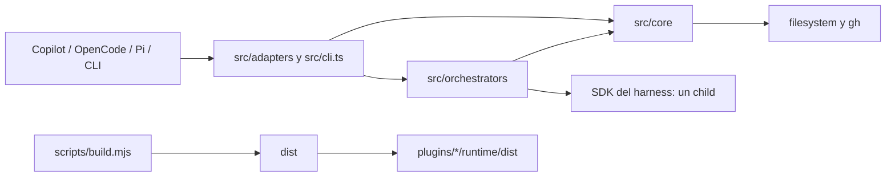

# Arquitectura de Agent Harbor

Este documento describe la implementación actual de Agent Harbor 0.12.0. Es
operativo y explicativo; [REQUIREMENTS.md](REQUIREMENTS.md) sigue siendo la
fuente normativa cuando exista una discrepancia.

## Principios e invariantes

1. **Un solo core.** Validación, comandos, roster, ownership, rendering, skills
   y GitHub viven en `src/core`. Los adapters traducen esas decisiones a cada
   host; no mantienen una segunda implementación del lifecycle.
2. **Tres clases de player.** Los roles fijos `team-lead`,
   `repo-cartographer` y `crafter` siempre están disponibles; los seis players
   SDLC de `bundledPlayers` empiezan en banca; un player personal tiene un
   registro persistente y una copia activa por proyecto.
3. **Lifecycle determinista.** `bench`, `join`, `retire` y `list-skills` tienen
   un backend que no crea sesiones ni invoca modelos. `bench list` tampoco usa
   red. `list-skills` sí puede usar el `gh` autenticado, pero nunca inferencia.
4. **Un contrato, un child.** Un `/contract` válido crea exactamente un child
   desechable después de completar todo el preflight. Un input o skill inválido
   crea cero children y nunca altera el roster.
5. **Delegación nominal y acotada.** `team-lead` sólo puede seleccionar players
   activos, nunca a sí mismo, y ejecuta de uno a seis especialistas de forma
   secuencial. La evidencia de una etapa vuelve antes de abrir la siguiente.
6. **Fail closed.** Filename, ID, metadata, marcador, clase de roster,
   definición embebida y frontmatter ejecutable deben concordar. Traversal,
   symlinks, perfiles stale y colisiones no administradas se rechazan.
7. **Ownership antes que conveniencia.** Agent Harbor nunca sobrescribe o
   elimina un archivo que no demuestre ownership completo. Una colisión aborta
   el lote entero.
8. **Mutaciones transaccionales.** Las mutaciones comparten un lock por home,
   capturan los bytes anteriores, escriben atómicamente, verifican el resultado
   y hacen rollback byte a byte ante cualquier fallo.
9. **Skills cerradas por player.** Sólo se carga el `SKILL.md` exacto declarado
   en la definición, con un máximo de tres referencias. No existe discovery
   ambiental implícito ni persistencia de cuerpos remotos.
10. **Artefactos reproducibles.** `dist/` y `plugins/*/runtime/dist/` se generan
    desde `src/` con `scripts/build.mjs`; nunca son la fuente que se edita.

## Capas y dirección de dependencias

| Capa | Responsabilidad | Regla de imports |
| --- | --- | --- |
| `src/core` | Tipos, catálogo, comandos, perfiles, roster, active discovery, GitHub, skills y evidencia normalizada. | Sólo Node y otros módulos del core; no importa SDKs ni adapters. `profiles.ts` calcula la ruta compilada de `copilot-mcp.js` para renderizar perfiles, pero no importa ese adapter. |
| `src/adapters` | Registro nativo, superficies directas, traducción de tools/permisos y preflight específico del host. | Puede importar core, su SDK y orchestrators. No debe duplicar reglas de negocio del roster. |
| `src/orchestrators` | Preparar, crear, ejecutar y limpiar un child con el SDK de un harness. | Importa core y un SDK; no registra ni muta players persistentes. |
| `src/cli.ts` | Bin portable `agent-harbor`; despacha controles directos y el contrato programático de Copilot. | Importa el backend compartido y carga el orquestador Copilot sólo cuando hace falta. |
| `plugins/` | Manifests y superficies Copilot estáticas: agentes, skills fallback, MCP y extensión client. | Consume copias compiladas bajo su propio `${PLUGIN_ROOT}`. |
| `scripts/` | Build y runners offline/live. | Orquesta procesos; no es otro runtime del producto. |
| `dist/` | JavaScript y declaraciones publicables. | Salida generada, no fuente. |

Los contratos públicos básicos están en `src/core/types.ts`: `PlayerDefinition`,
`ContractDefinition`, `HarnessSpec`, `Orchestrator`, `SkillReference` y los
nombres de comando. `src/core/commands.ts:executeCommand` es el único switch de
los cinco comandos.

## Entrypoints y superficies nativas

| Consumidor | Entrypoint | Superficie principal |
| --- | --- | --- |
| Copilot marketplace | `.github/plugin/marketplace.json` y los `plugin.json` | Instala `agent-foundry` y `repo-cartographer`. |
| Copilot extensión | `plugins/agent-foundry/extensions/agent-harbor/extension.mjs` | Comandos client deterministas, `/harbor-<id>`, cambio/restauración de agente y guard de `team-lead`. |
| Copilot MCP | `plugins/agent-foundry/.mcp.json` → runtime generado `adapters/copilot-mcp.js` | Tool global `control`; un proceso `--skills-player <id>` publica sólo `skills` para ese player. |
| Copilot fallback | `plugins/agent-foundry/skills/*/SKILL.md` | Wrappers mínimos de los cinco comandos cuando no está disponible la extensión directa. |
| OpenCode server | export `.`/`./server` → `dist/adapters/opencode.js` | Plugin `AgentHarborPlugin`: commands, agents y tools `harbor`, `harbor_contract`, `harbor_delegate`, `agent_harbor_skills`. |
| OpenCode TUI | export `./tui` → `dist/adapters/opencode-tui.js` | Paleta y diálogos directos sin modelo. |
| Pi | manifest `package.json.pi.extensions` y export `./pi` → `dist/adapters/pi.js` | `ExtensionAPI.registerCommand`/`registerTool`; players reales mediante sesiones SDK en memoria. |
| CLI universal | `package.json.bin.agent-harbor` → `dist/cli.js` | `agent-harbor <harness> <command> [args]`. |
| API mínima | export `./core` → `dist/core/commands.js` | Contrato programático compartido de comandos. |

`src/adapters/shared.ts:defaultHome` resuelve el home por harness, respetando
`COPILOT_HOME`, `OPENCODE_CONFIG_DIR` o `PI_CODING_AGENT_DIR`. Su
`harborContext` ensambla `Roster`, catálogo bundled, `GhResolver`, allowlist de
skills y el orquestador elegido.

## Flujos de ejecución

### Controles deterministas

La ruta preferida termina en
`src/adapters/direct.ts:runDeterministicCommand`. Ésta inyecta un orquestador
que falla si alguien intenta usarlo y llama a `executeCommand`:

1. la superficie nativa conserva los argumentos literales y fija el proyecto;
2. `harborContext` construye dependencias comunes;
3. `executeCommand` delega en `Roster` o `GhResolver`;
4. el resultado vuelve sin sesión SDK, child ni prompt.

Copilot usa handlers client en `extension.mjs`; OpenCode usa
`openCodeDirectCommands`; Pi usa handlers `registerCommand`; el CLI sirve como
ruta portable. Los comandos canónicos fallback de Copilot/OpenCode pueden ser
mediados por el modelo debido a la superficie del host, aunque el backend que
finalmente ejecutan siga siendo determinista.

Semántica común:

- `bench [list [filter]]` calcula estados; `bench on|off` activa o elimina sólo
  copias de proyecto. `all` expande los seis bundled en orden canónico.
- `join <json>` valida, renderiza y escribe registro + copia activa.
- `retire <id>` elimina el registro personal y la copia activa del proyecto
  actual; otros proyectos quedan intactos.
- `list-skills [filter]` filtra `trustedSkills` y reporta ref, commit y blob sin
  descargar, mostrar, instalar o cachear el body.

### `/contract`

`parseContractDefinition` exige un objeto JSON cerrado, prohíbe `replace`,
exige `task` no vacío y reutiliza `validatePlayer`. Las skills se resuelven por
completo antes de crear el child.

| Harness | Implementación | Child y política |
| --- | --- | --- |
| Copilot plugin | `runCopilotControl` valida y devuelve exactamente `{agent_type, description, prompt}`; `plugins/agent-foundry/skills/contract/SKILL.md` llama una vez al `task` nativo. | El host posee el lifecycle del único child. El tipo es `general-purpose`, `task` o `explore` según tools. |
| Copilot programático/CLI | `CopilotOrchestrator.run` | Un `CopilotClient` y una custom-agent session, sin config discovery, con tools/skills exactas; luego delete session y stop client. |
| OpenCode | `OpenCodeOrchestrator.run` | Una `client.session.create`; agente runtime `general` si edita/ejecuta y `explore` en otro caso; tools cerradas; `session.delete` en `finally`. |
| Pi | `PiOrchestrator.run` | Una `createAgentSession` con `SessionManager.inMemory`, tools exactas y resource loader aislado; `dispose` en `finally`. |

Un fallo de ejecución y otro de cleanup se conservan juntos en un
`AggregateError`; limpiar nunca debe ocultar el fallo original ni viceversa.

### Invocación directa de un player

La invocación nominal evita una inferencia de routing:

- Copilot `/harbor-<id>` recarga agentes, resuelve el ID fijo namespaced o el
  path administrado exacto, selecciona el agente, envía una tarea y restaura la
  selección anterior bajo `withSelectionLock`.
- OpenCode configura `/harbor-<id>` con `agent: <id>`,
  `template: "$ARGUMENTS"` y `subtask: false`; el hook previo vuelve a validar
  tarea, actividad y ownership.
- Pi registra `/<id>` y `runPlayer` abre una sesión SDK en memoria con la
  definición fija o recuperada del perfil activo.

Una tarea vacía, un bundled apagado o un perfil no canónico falla antes de
enviar el prompt.

### `team-lead`

El contrato del coordinador está en `src/core/defaults.ts:rolePlayers` y, para
Copilot, en `plugins/agent-foundry/agents/team-lead.agent.md`. Debe elegir el
subconjunto mínimo, no hacer trabajo de especialista en el parent, consumir
cada especialista exitoso una sola vez y sintetizar sólo la evidencia devuelta.

| Harness | Boundary de delegación | Controles ejecutables |
| --- | --- | --- |
| Copilot | `task` nativo + `createCopilotCoordinatorGuard` | Snapshot de agentes fuera del hook; target exacto activo; path revalidado; sin recursión/nesting; máximo seis y uno in-flight por prompt. `selectionEpoch` impide que un refresh tardío pise una selección más nueva. El host ejecuta y termina cada `task` síncrono. |
| OpenCode | Tool exclusiva `harbor_delegate` | Enum de targets activos al iniciar; resolución del turno de usuario raíz; modelo/variant heredado; máximo seis, sin target repetido y uno in-flight. Cada llamada usa `runAgent`, normaliza paths absolutos del proyecto y borra la sesión child. |
| Pi | Custom tool `harbor_delegate` en la sesión del lead | Enum capturado al crearla, `executionMode: "sequential"`, máximo seis y sin target repetido. Cada dispatch reconstruye la definición y abre/limpia una sesión child. |

Los roles SDLC bundled son peers en este orden cuando todos los gates son
obligatorios: `portfolio-management → design → build → manage → consume →
dispose`. Para tareas ordinarias no se abre la cadena completa por defecto.

## Persistencia, ownership y estados

`src/core/profiles.ts:harnessSpec` define dos destinos por harness:

| Harness | Registro personal bajo el home | Copia activa bajo el proyecto |
| --- | --- | --- |
| Copilot | `agent-foundry/bench/<id>.agent.md` | `.github/agents/<id>.agent.md` |
| OpenCode | `agent-foundry/bench/<id>.md` | `.opencode/agents/<id>.md` |
| Pi | `agent-foundry/bench/<id>.md` | `.pi/agents/<id>.md` |

Las clases tienen lifecycle diferente:

| Clase | Fuente | Persistencia | Activación |
| --- | --- | --- | --- |
| Fija | `rolePlayers` y assets Copilot | No usa roster de usuario. | Siempre invocable. |
| Bundled SDLC | `bundledPlayers` | Sólo copia activa de proyecto. | `bench on`; `bench off` la elimina. |
| Personal | JSON de `join` | Registro en home + copia activa inicial. | `bench off` conserva registro; `bench on` re-renderiza desde revisión 4; `retire` elimina registro y copia actual. |
| Legacy | IDs `scout`, `sage`, `smith`, `probe`, `guard`, `pilot` | Sólo se reconoce para cleanup seguro. | Nunca se reactiva ni se acepta como target. |

Un perfil revisión 4 renderizado por `renderPlayer` contiene:

- frontmatter nativo del harness;
- metadata única `owner: agent-foundry`, `roster`, `player` y
  `revision: "4"`;
- marcador `agent-foundry:profile` con el mismo ID y revisión;
- definición JSON canónica, sin `replace`, codificada en base64url;
- instrucciones compuestas para el player.

`isOwnedProfile` prueba ownership estructural; no basta para invocar.
`isCanonicalPlayerProfile` además exige que la definición decodificada y toda
la representación ejecutable coincidan con el renderer actual. Copilot acepta
como equivalente sólo una ruta MCP alternativa cuyo archivo sea regular,
byte-idéntico al entrypoint esperado y no sea symlink. Una revisión 3 puede
limpiarse o reemplazarse, pero no reactivarse.

`Roster.bench` expone `on`, `bench`, `stale` y `conflict`. Para legacy también
existe `retired-active`. En términos operativos:

- `on`: perfil activo, owned y canónico;
- `bench`: no hay copia activa recuperable;
- `stale`: Agent Harbor reconoce ownership, pero no puede reconstruir o
  aceptar la representación como canónica;
- `conflict`: existe contenido que Agent Harbor no posee en ese destino.

## Lock, transacción y rollback

Toda mutación entra por `Roster.withMutationLock`:

1. rechaza traversal/symlinks y abre
   `<home>/agent-foundry/bench/.roster.lock` con `wx`, modo `0600`;
2. escribe y sincroniza `{owner, pid, token}`;
3. ante `EEXIST`, sólo espera un lock administrado con proceso vivo; elimina
   uno huérfano únicamente si su contenido no cambió; un lock ambiguo o ajeno
   es una colisión;
4. al salir, verifica tipo y token antes de retirar el lock.

`Roster.transaction` hace preflight de todos los paths y captura `Buffer`s
exactos. Cada escritura usa un temporal exclusivo en el mismo directorio,
modo `0600`, seguido de `rename`; cada eliminación afecta sólo el archivo.
Después verifica bytes o ausencia. Si algo falla, restaura el lote en orden
inverso; si también falla el rollback lanza un `AggregateError` que conserva
todos los errores. Nunca elimina directorios.

`join` y `retire` son transacciones de dos archivos. Un `bench on|off` de varios
IDs es una sola transacción y su preflight incluye el cleanup de perfiles SDLC
legacy owned. Una colisión legacy unmanaged aborta todo el lote.

## Rendering y discovery seguro

`src/core/profiles.ts:nativeTools` traduce las capacidades abstractas:

| Capacidad | Copilot | OpenCode | Pi |
| --- | --- | --- | --- |
| `read` | `read` | `read` | `read` |
| `search` | `search` | `grep`, `glob` | `grep`, `find`, `ls` |
| `edit` | `edit` | `apply_patch` | `edit`, `write` |
| `execute` | `execute` | `bash` | `bash` |

OpenCode genera además una política de tools y permisos deny-by-default,
deshabilita `task`, web, preguntas y la tool ambiental `skill`, y acota
`external_directory` al proyecto. Estas allowlists son límites del SDK, no un
sandbox del sistema operativo.

`src/core/active.ts` es la puerta de discovery de Agent Harbor:

1. limita el directorio activo a 200 candidatos;
2. rechaza symlinks en el directorio, ancestros o entradas;
3. acepta sólo IDs válidos, archivos regulares de hasta 30.000 bytes y
   ownership de la clase esperada;
4. decodifica, vuelve a validar y compara el perfil canónico;
5. ante dispatch, `requireInvocablePlayer` devuelve un rol fijo o esa definición
   validada; nunca confía sólo en que el host haya descubierto un filename.

Copilot resuelve roles fijos a IDs namespaced mediante
`copilotFixedAgentIds`; un personal/bundled debe coincidir además con el path
exacto del proyecto expuesto por el host. OpenCode inyecta sólo perfiles
canónicos en `config.agent` y retira de esa configuración los owned stale. Pi
trata `.pi/agents` como almacenamiento privado: registra comandos desde
`listManagedActiveIds`, no confía en discovery de prompts de Pi. Los aliases
capturados al inicio requieren reload para aparecer/desaparecer, pero cada
dispatch vuelve a validar estado y ownership.

## Skills y límites de confianza

`PlayerDefinition.skills` es una allowlist de cero a tres referencias con
nombres únicos. Una lista no vacía requiere la capacidad `read`.

- `kind: "repo"` autoriza un único path relativo terminado en `SKILL.md` bajo
  el proyecto. `readRepositorySkill` rechaza paths ambiguos, escape físico y
  symlinks en cualquier segmento.
- `kind: "github"` debe coincidir exactamente con `trustedSkills` por nombre,
  repo, path y `refs/heads/...`. `GhResolver` resuelve primero la rama a un SHA
  de commit y descarga el archivo exacto fijado a ese SHA mediante `gh api`.
  Cada proceso tiene timeout de 20 s, señal de cancelación y buffer acotado;
  Agent Harbor no almacena credenciales.

`parseSkillBody` exige UTF-8 válido, 1..18.000 bytes, frontmatter en primera
línea, un solo `name` coincidente y body no vacío. El grupo completo no puede
superar 30.000 bytes; un prompt preparado no puede superar 50.000. Cuando se
materializa, `createSkillCapsule` crea sólo
`<tmp>/agent-harbor-skills-*/<name>/SKILL.md`, con permisos privados, y su
cleanup sólo puede borrar ese root temporal validado.

El enforcement cambia en el boundary de cada host:

| Harness | Entrega de skills | Trust boundary |
| --- | --- | --- |
| Copilot SDK | Cápsula invocation-local, `enableConfigDiscovery: false`, nombres exactos en `customAgents.skills`. | No ve skills ambientales. Para perfiles Copilot, cada player tiene su propio MCP `--skills-player`; el tool no acepta referencias aportadas por el modelo. |
| OpenCode | Contratos inyectan bodies ya validados en el prompt. Perfiles con skills reciben sólo `agent_harbor_skills`, que deriva el player desde `execution.agent`. | La tool ambiental `skill` permanece denegada y un player sin skills no recibe el loader Harbor. |
| Pi | Cápsula con paths exactos, resource loader sin extensiones/skills/prompts/themes/context ambiental y `skillsOverride` validado. | Cualquier diagnostic, nombre duplicado, path extra o skill faltante falla antes de crear la sesión. |

El texto de una skill es guidance no confiable de menor precedencia que usuario,
repositorio y player. Nunca amplía tools, persistencia, fuentes o alcance. El
aislamiento de skills no es una ACL de filesystem/red: las capacidades
ordinarias declaradas (`read` o `execute`, por ejemplo) siguen existiendo.

## Lifecycle de children, cleanup y evidencia

Cada método `Orchestrator.run` sigue la misma máquina conceptual:

`preflight → target.resolved → child.started → prompt.attempted →
evidence.returned → child.completed|child.failed → child.cleaned`.

La preparación puede fallar antes de que exista un child. Copilot aborta y
elimina la session, detiene el client y limpia la cápsula; OpenCode borra la
session; Pi cancela si corresponde, desuscribe eventos, hace `dispose` y limpia
la cápsula. Una señal `AbortSignal` se propaga al SDK y a `gh`.

`src/core/evidence.ts` normaliza observabilidad opcional con schema
`agent-harbor/evidence@1`. Conserva harness, identidad lógica/runtime,
correlación, outcome y sólo SHA-256 + tamaño UTF-8 de task, evidencia o error;
nunca su texto. `basis` distingue eventos `observed` de inferencias. El guard
Copilot correlaciona `toolCallId` y puede marcar como inferido el lifecycle que
el hook síncrono del host no expone. `emitHarborEvidence` absorbe fallos
síncronos o asíncronos del collector: observar nunca cambia ejecución ni
cleanup.

## Build y artefactos generados

`npm run build` ejecuta únicamente `scripts/build.mjs`: elimina los tres
árboles generados, ejecuta TypeScript con `noEmitOnError` y luego copia el
runtime Copilot desde ese mismo `dist`.

| Entrada fuente | Salida generada | Consumidor |
| --- | --- | --- |
| `src/**/*.ts` | `dist/**/*.js` y `dist/**/*.d.ts` | Paquete npm, CLI, OpenCode y Pi. |
| `dist/core/*.js` | `plugins/agent-foundry/runtime/dist/core/*.js` y `plugins/repo-cartographer/runtime/dist/core/*.js` | Ambos plugins Copilot; copia física porque `${PLUGIN_ROOT}` cambia por plugin. |
| `dist/adapters/{shared,copilot,copilot-mcp}.js` | Mismos paths bajo ambos runtimes de plugin | MCP global/player-scoped y preflight Copilot. |
| `dist/adapters/{direct,copilot-coordinator}.js` | Sólo `plugins/agent-foundry/runtime/dist/adapters/` | Controles client y guard del coordinador. |
| Manifests, `plugins/*/agents`, `plugins/*/skills`, `extension.mjs` | No se generan | Assets Copilot revisados como fuente. |

El test `Copilot runtime is generated byte-for-byte from shared core` protege
esta matriz. Si cambia `src/`, se ejecuta el build y se incluyen las salidas
generadas correspondientes; no se parchean a mano.

## Estrategia de pruebas offline y live

`npm test` es el gate offline normal: `scripts/run-tests.mjs` hace un build
limpio y ejecuta `scripts/run-test-suite.mjs`. El wrapper borra
`NODE_TEST_CONTEXT`, valida exit code/señal y exige un único resumen TAP con al
menos un test y `fail: 0`. La suite predeterminada cubre contratos, adapters,
matriz de agentes, ciclos/evidencia y compatibilidad. Usa SDK doubles y el
dataset literal `test-ts/fixtures/harbor-cycles.json`; no invoca modelos ni red.

Los smokes live son opt-in, autenticados y separados:

| Comando | Harness | Reporte ignorado por git |
| --- | --- | --- |
| `npm run test:live:lead` | Copilot | `work/live-team-lead-report.json` |
| `npm run test:live:opencode` | OpenCode | `work/live-opencode-team-lead-report.json` |
| `npm run test:live:pi` | Pi | `work/live-pi-team-lead-report.json` |
| `npm run test:live:codex` | OpenCode + Pi | Los dos anteriores. |

Los runners live construyen primero, borran reportes stale, ejecutan el runner
nativo y exigen schema, `status: passed` y timestamp fresco; el modo
`--verify-report-only` admite como máximo 24 horas. El caso `full-sdlc` prueba
selección semántica real, secuencia exacta, handoff acotado, identidad nativa,
uso positivo, presupuestos, no solapamiento y cleanup. Los reportes retienen
sólo metadata y fingerprints permitidos, no tasks/respuestas/paths secretos.

El gate de entrega completo está en `REQUIREMENTS.md`: después de `npm test`,
ejecutar `npm audit --audit-level=high`, `npm pack --dry-run --json` y
`git diff --check`. Un cambio de selección, handoff u hooks debe correr además
el smoke live del harness afectado.

## Guía segura de extensión

1. **Empiece por el contrato.** Si cambia inputs, estados o superficies,
   actualice primero el requisito y una prueba de aceptación independiente del
   catálogo runtime. No añada sin necesidad comandos alternativos al conjunto
   cerrado actual.
2. **Ponga la regla una vez.** Validación y lifecycle van en `src/core`; el
   adapter sólo registra y traduce. Mantenga la dirección de imports anterior.
3. **Preserve el schema cerrado.** Al ampliar `PlayerDefinition`, actualice
   `validatePlayer`, definición codificada/canónica, límites, reserved IDs y
   casos de rechazo para claves desconocidas.
4. **Preserve ownership.** Toda nueva escritura administrada debe usar el
   renderer y la transacción del `Roster`, verificar containment/symlinks y
   negarse a tocar colisiones. No cree un cleanup basado sólo en filename.
5. **Preserve cero modelo.** Un resultado determinista debe pasar por
   `runDeterministicCommand` y tener superficie directa equivalente en los tres
   harnesses. Demuestre que el orquestador no fue llamado.
6. **Preserve el child boundary.** Haga todo el preflight antes de crear una
   sesión, entregue una allowlist nativa, cree exactamente un child por
   `Orchestrator.run`, limpie en `finally` y agregue errores dobles.
7. **No ensanche skills implícitamente.** Añada referencias sólo a la allowlist
   exacta, mantenga el loader player-scoped y pruebe nombres/paths extra,
   diagnostics y cleanup. Nunca convierta una carpeta o repo completo en scope.
8. **Mantenga evidencia no sensible.** Extienda `HarborEvidenceEvent` con
   metadata acotada; para contenido use fingerprints, no texto en claro.
9. **Genere, no edite outputs.** Cambie `src/` o los assets fuente, ejecute
   `npm run build`, compruebe la matriz byte a byte y luego el gate offline.
10. **Valide en proporción al riesgo.** Añada regresiones para los tres
    harnesses cuando toque core; use el live correspondiente sólo cuando cambie
    comportamiento que requiera inferencia real.
