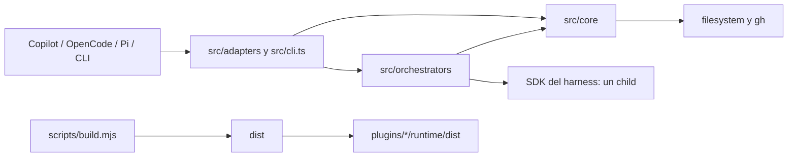

# Arquitectura de Agent Harbor

Este documento describe la implementación actual de Agent Harbor 0.12.1. Es
operativo y explicativo; [REQUIREMENTS.md](REQUIREMENTS.md) sigue siendo la
fuente normativa cuando exista una discrepancia.

La reducción de complejidad aplicada sobre esta arquitectura, sus límites y
sus métricas están en [SIMPLIFICATION-PLAN.md](SIMPLIFICATION-PLAN.md).

## Principios e invariantes

1. **Un solo core.** Validación, comandos, roster, ownership, rendering, skills
   y GitHub viven en `src/core`. Los adapters traducen esas decisiones a cada
   host; no mantienen una segunda implementación del lifecycle.
2. **Tres clases de player.** Los roles fijos `team-lead` y `crafter` siempre
   están disponibles; los seis players
   SDLC de `bundledPlayers` empiezan en banca; un player personal tiene un
   registro persistente y una copia activa por proyecto.
3. **Lifecycle determinista.** `bench`, `join`, `retire` y `list-skills` tienen
   un backend que no crea sesiones ni invoca modelos. `bench list` tampoco usa
   red. `list-skills` sí puede usar el `gh` autenticado, pero nunca inferencia.
   `/team` consulta y detiene actividad mediante la superficie nativa directa
   de cada host, también sin inferencia.
4. **Un contrato, un child.** Un `/contract` válido crea exactamente un child
   desechable después de completar todo el preflight. Un input o skill inválido
   crea cero children y nunca altera el roster.
5. **Delegación nominal y acotada.** `team-lead` sólo puede seleccionar players
   activos, nunca a sí mismo, y ejecuta de uno a seis especialistas de forma
   secuencial. La evidencia de una etapa vuelve antes de abrir la siguiente.
6. **Fail closed.** Filename, ID, metadata, marcador, clase de roster,
   definición embebida y frontmatter ejecutable deben concordar. Traversal,
   symlinks, perfiles stale y colisiones no administradas se rechazan.
7. **Ownership antes que conveniencia.** Agent Harbor nunca sobrescribe o
   elimina un archivo que no demuestre ownership completo. Una colisión aborta
   el lote entero.
8. **Mutaciones transaccionales.** Las mutaciones comparten un lock por home,
   capturan los bytes anteriores, escriben atómicamente, verifican el resultado
   y hacen rollback byte a byte ante cualquier fallo.
9. **Skills cerradas por player.** Sólo se carga el `SKILL.md` exacto declarado
   en la definición, con un máximo de tres referencias. No existe discovery
   ambiental implícito ni persistencia de cuerpos remotos.
10. **Artefactos reproducibles.** `dist/` y `plugins/*/runtime/dist/` se generan
    desde `src/` con `scripts/build.mjs`; nunca son la fuente que se edita.
11. **Reclutamiento acotado.** `/scout` consume un turno del agente fijo
    `talent-scout`, que primero consulta un snapshot acotado del roster para no
    duplicar capacidad y, sólo si falta, puede filtrar metadata de referencias
    confiables y hacer un `join`; no forma parte de los targets delegables del
    coordinador.

## Capas y dirección de dependencias

| Capa | Responsabilidad | Regla de imports |
| --- | --- | --- |
| `src/core` | Tipos, identidad/layout, catálogo visible configurable, comandos, perfiles, roster, active discovery, GitHub, skills, contratos comunes de custom tools y evidencia normalizada. | Sólo Node y otros módulos del core; no importa SDKs ni adapters. `custom-tools.ts` define nombres, schemas cerrados, principals y validación sin depender de un transporte. |
| `src/adapters` | Registro nativo, superficies directas, traducción de tools/permisos y preflight específico del host. | Puede importar core, su SDK y orchestrators. No debe duplicar reglas de negocio del roster. |
| `src/orchestrators` | Preparar, crear, ejecutar y limpiar un child con el SDK de un harness. | Importa core y un SDK; no registra ni muta players persistentes. |
| `src/cli.ts` | Bin portable `agent-harbor`; despacha controles directos y el contrato programático de Copilot. | Importa el backend compartido y carga el orquestador Copilot sólo cuando hace falta. |
| `plugins/` | Manifest y superficies Copilot estáticas: agentes, skill de `/contract` y extensión client con custom tools nativas. | Consume copias compiladas bajo su propio `${PLUGIN_ROOT}`. |
| `scripts/` | Build y runners offline/live. | Orquesta procesos; no es otro runtime del producto. |
| `dist/` | JavaScript y declaraciones publicables. | Salida generada, no fuente. |

Los contratos públicos básicos están en `src/core/types.ts`: `PlayerDefinition`,
`ContractDefinition`, `HarnessSpec`, `Orchestrator`, `SkillReference` y los
nombres de comando. `src/core/commands.ts:executeCommand` es el único switch de
los cinco comandos.

`src/core/identity.ts` es la única definición de la sintaxis de IDs compartida
por players y skills. `src/core/harnesses.ts` concentra directorio activo y
extensión por harness; rendering, discovery y resolución Copilot consumen el
mismo layout.

## Entrypoints y superficies nativas

| Consumidor | Entrypoint | Superficie principal |
| --- | --- | --- |
| Copilot marketplace | `.github/plugin/marketplace.json` y `plugins/agent-foundry/plugin.json` | Instala únicamente `agent-foundry`. |
| Copilot extensión | `plugins/agent-foundry/extensions/agent-harbor/extension.mjs` | `/team` con overview dinámico, controles client deterministas, `/player`, aliases `/<id>`, runner terminal seguro y guard de `team-lead`. |
| Copilot custom tools | `extension.mjs` → `joinSession({ tools: copilotNativeTools })` | La API pública fija al arrancar la unión mínima: `harbor_contract`, las tres tools del scout (`harbor_team_roster`, filtro y join) y un `harbor_skill_<id>` sólo por cada rol fijo o perfil activo canónico que tenga skills. La consulta de roster queda ligada al scout, es read-only y acotada; no incluye loaders de players en banca ni delegación, no ejecuta un servidor/proceso auxiliar y nunca acepta un player ID aportado por el modelo. |
| Copilot model-backed | `plugins/agent-foundry/skills/contract/SKILL.md` | Único wrapper Markdown: `/contract` hace preflight y crea exactamente un child. Los cuatro controles deterministas no tienen fallback skill. |
| OpenCode server | export `.`/`./server` → `dist/adapters/opencode.js` | Plugin `AgentHarborPlugin`: agents, aliases directos de especialistas y tools acotadas de lead/scout/skills. No registra fallbacks lifecycle mediados por modelo ni una tool ambiental genérica `harbor`. |
| OpenCode TUI | export `./tui` → `dist/adapters/opencode-tui.js` | Nueve entradas directas: ocho controles deterministas cero modelo y `/contract`, que crea exactamente un child. `/team` usa 30 líneas/96 columnas, detalle por filtro, diagnósticos paginados, claims cross-isolate y stop verificado. |
| Pi | manifest `package.json.pi.extensions` y export `./pi` → `dist/adapters/pi.js` | `ExtensionAPI.registerCommand` publica controles y aliases; las custom tools se inyectan sólo en el child que las necesita, no mediante `registerTool`. `/team` usa overview dinámico y los players abren sesiones SDK en memoria. |
| CLI universal | `package.json.bin.agent-harbor` → `dist/cli.js` | `agent-harbor <harness> <command> [args]`. |
| API mínima | export `./core` → `dist/core/commands.js` | Contrato programático compartido de comandos. |

`src/adapters/shared.ts:defaultHome` resuelve el home por harness, respetando
`COPILOT_HOME`, `OPENCODE_CONFIG_DIR` o `PI_CODING_AGENT_DIR`. Su
`harborContext` ensambla `Roster`, catálogo bundled, `GhResolver`, allowlist de
skills y el orquestador elegido.

## Flujos de ejecución

### Controles deterministas

La ruta preferida termina en
`src/adapters/direct.ts:runDeterministicCommand`. Ésta inyecta un orquestador
que falla si alguien intenta usarlo y llama a `executeCommand`:

1. la superficie nativa conserva los argumentos literales y fija el proyecto;
2. `harborContext` construye dependencias comunes;
3. `executeCommand` delega en `Roster` o `GhResolver`;
4. el resultado vuelve sin sesión SDK, child ni prompt.

Copilot usa handlers client en `extension.mjs`; OpenCode usa
`openCodeDirectCommands`; Pi usa handlers `registerCommand`; el CLI sirve como
ruta portable. Copilot no publica fallbacks skill para controles deterministas:
si la extensión experimental no está activa se usa el CLI directo. OpenCode
expone lifecycle y catálogo sólo por sus controles TUI directos o el CLI; al
reconciliar configuración elimina únicamente aliases legacy exactos y conserva
comandos extranjeros. El servidor no ofrece una ruta lifecycle mediada por
modelo ni una tool genérica que el modelo pueda invocar.

La TUI de OpenCode mantiene un epoch de display, comparte snapshots in-flight,
serializa una sola mutación y liga cada prompt/alert a un token de ownership.
Al descargarse aborta lecturas y limpia sólo el diálogo Harbor aún vigente; un
diálogo posterior del host o de otra extensión no se toca. Todos los inputs se
acotan antes de trim, parseo, filesystem, catálogo o RPC. El resultado de join
se proyecta a rol/capacidad/modelo/alias público y nunca devuelve los paths que
produce el backend común.

La superficie pública Copilot de custom tools se decide una sola vez antes de
`joinSession`. Por eso `join` puede persistir un player y escribir su copia
activa durante la sesión. Si el `harbor_skill_<id>` ligado no formaba parte de
la unión de inicio, no existe hasta `/reload`; si ya estaba registrado —por
ejemplo, al reemplazar el mismo ID que arrancó con skills— el handler reutiliza
ese nombre fijo y
revalida la definición actual sin recargar. Un player que no necesita loader
nuevo puede quedar disponible por `/player` en la sesión actual cuando el
refresh autoritativo también confirma su identidad; un alias `/<id>` nuevo se
incorpora al recargar.

El commit de `/join` no prueba por sí solo que Copilot haya incorporado el
perfil a su registro nativo. La extensión informa `registered`, ejecuta el
refresh autoritativo cuando puede y dirige a `/team member:<id>`; sólo ese estado
`ready`, junto con la presencia del loader ligado cuando aplica, habilita el
runner. Así la confirmación no convierte persistencia en una promesa de
disponibilidad.

Los formatters Pi y Copilot prueban primero la vista completa y acotan toda
salida visible a 30 líneas envueltas de 96 celdas. En el overview reducen en
bucle sólo las cuotas de personales y actividad: los nueve miembros no
personales de fábrica son invariantes y cada cuota omitida produce conteo y
filtros. Una consulta estrecha dedica el mismo presupuesto a detalle rico;
Copilot descuenta además diagnóstico SDK/host y reparación del total, de modo
que los adjuncts nunca se suman después de una vista ya completa. OpenCode aplica
el mismo ancho y máximo a overview, filtros y ayuda, cambiando de compacto a
detalle sólo cuando la coincidencia es estrecha y reservando el footer de
privacidad en help. Los adapters acotan también los resultados masivos de stop
al mismo alto/ancho y sustituyen el exceso por un conteo más una ruta de
inspección; no vuelcan una fila ilimitada por cada owner externo.

La normalización de modelo ocurre antes del rendering. Pi combina su placeholder
0.80.10 `unknown/unknown` con máximo cero —o un modelo ausente— con la
instantánea sana/error del registry: distingue catálogo vacío, selección
pendiente y disponibilidad no observada, sin publicar un máximo cero ni prometer
delegación. Copilot marca las variantes vacía/`unknown`/`unknown/default`/
`default` como no informadas y las muestra `unobserved`, nunca como selección
efectiva.

Pi mantiene `noExtensions` en cada child. Si el modelo depende de un provider
registrado en memoria, el adapter captura sólo las configuraciones requeridas y
las reproduce con el `ModelRuntime` público del SDK; las keys de origen runtime
se copian únicamente en memoria. No se accede al runtime privado del registry ni
se recargan tools, skills o extensiones del host.

Semántica común:

- `bench [list [filter]]` calcula estados; `bench on|off` activa o elimina sólo
  copias de proyecto. `all` expande los seis bundled en orden canónico.
- `join <json>` valida, renderiza y escribe registro + copia activa, y devuelve
  el alias nominal `/<id> <request>` que los adapters proyectan como comando.
- `retire <id>` elimina el registro personal y la copia activa del proyecto
  actual; otros proyectos quedan intactos.
- `list-skills [filter]` carga el override cerrado
  `.agent-harbor/skill-sources.json`, enumera scopes `repository`, `folder` o
  `skill` desde una rama resuelta y muestra sólo repositorio, path y nombre. No
  descarga, muestra, instala ni cachea bodies. Un override visible del proyecto
  no amplía `trustedSkills` ni `trustedSkillRepositories`, usados para ejecución.

### Actividad persistente compartida entre Pi y Copilot

`PiTeamRuntime` y `CopilotTeamRuntime` conservan en memoria sólo el árbol rico
local: IDs, tarea reducida, modelo/thinking o reasoning, usage/coste y hasta 32
misiones terminales. En paralelo, todo root o child de un player nombrado toma
un claim mínimo en `team-activity-v1`, implementado por
`opencode-agent-activity.ts` pero separado del inventario nativo de OpenCode.
Ese namespace converge por la identidad canónica del proyecto físico entre
procesos Pi y Copilot, aunque usen homes de harness distintos. Los wrappers y
children anónimos de `/contract` no entran: su telemetría e historial son
process-local. Un claim v2 de este namespace sólo acepta `ownerRuntime` `pi` o
`copilot`; `opencode` pertenece al namespace nativo separado y aquí degrada la
autoridad.

La admisión se serializa bajo el capacity lock del namespace compartido, con
máximo 32 claims persistentes por proyecto entre roots y children. La última
validación de definición corre dentro del gate antes de publicar `starting`; los
runners nominales de Pi/Copilot que capturan un snapshot de manager/recruiter lo
comparan también allí. El mismo gate excluye `retire`,
`bench off` y reemplazo mientras el target está reclamado; un manager o scout
protege conservadoramente todo su snapshot. El scout puede ignorar sólo su
propio token exacto durante el join que él mismo ejecuta.

La publicación usa el mismo binding, hard link atómico, identidad inode/device,
token y mtime verificados que los claims OpenCode, pero en su namespace propio.
El heartbeat vencido no libera ownership: con PID posiblemente vivo permanece
visible, busy y contado. Reclaim exige PID definitivamente ausente y segunda
lectura exacta. Release sólo confirma éxito cuando desaparece esa generación.
Lecturas y admisiones toman el capacity lock para validar hasta 64 entradas
no-lock y barrer generaciones muertas con una segunda comprobación exacta de
PID/token/inode/mtime. El archivo transitorio del lock no consume ese cupo, por
lo que 64 claims muertos no bloquean permanentemente `/team` ni la admisión; una
entrada no-lock 65, un PID vivo/ambiguo/reutilizado o una generación cambiante
siguen fallando cerrado. Un lock vencido sólo se recupera con PID definitivamente
ausente y la misma generación exacta.
Si una transición local ya no puede probarla, el adapter marca
`cleanup-error`, solicita abort del root owner y conserva el hazard de release;
no continúa declarando ownership seguro. En Pi ese hazard queda ligado a la
claim/generación exacta: mantiene ocupado al player y su slot hasta release o
recovery verificado, pero no se eleva al gate durable de todo el proyecto que
Copilot aplica más adelante. Una lectura ambigua del store sí degrada la
autoridad del inventario completo.

Los formatters unen runs locales con claims externos como filas
`shared-<player>`. La versión 2 expone sólo player, direct/delegated, fase,
elapsed y runtime/PID owner para routing. La versión 1 conserva el PID conocido,
pero se muestra como `owner runtime unverified (legacy claim)` porque no contiene
`ownerRuntime`. El texto libre filtra por player, alias, runtime y PID divulgados,
pero nunca por placeholders de tarea/modelo/usage omitidos. Tarea, modelo, usage,
jerarquía, IDs nativos, token y path siguen en el proceso owner. Sólo ese proceso
tiene la autoridad de stop. Si el store compartido no puede leerse, las vistas
muestran `≥` actividad local visible, marcan
disponibilidad como no verificada, conservan el warning en no-match y bloquean
selección/delegación. Pi aún puede abortar sus roots locales y advierte que no
verificó owners externos; Copilot hace fallar cerrado `/team stop` antes de
afirmar que inspeccionó todo el proyecto.

### Observabilidad nativa de OpenCode

El preflight del plugin de servidor usa el cliente v1 inyectado:
`session.status` seguido de `session.messages` sólo para sesiones no idle, con
32 actividades, ocho mensajes por sesión, concurrencia cuatro y deadlines
cerrados. `opencode-team-runtime.ts`, en cambio, combina roster determinista con
`session.list`, `active`, `get` y `messages` v2 para la vista y stop del TUI.
Prueba un child por su title HMAC session/project-bound. Una sesión directa se
liga primero por el claim filesystem exacto; sólo el fallback sin claim exige
el `agent` raw exacto contra un miembro no conflictivo. Los mensajes sólo se
proyectan después de esa prueba y nunca conservan assistant prose, reasoning o
payloads de tools.
Las custom tools del lead, scout y loader comparten una frontera de error que
redacta y acota fallos SDK/Gh antes de devolverlos al host, omite `cause` y
conserva el nombre `AbortError` sólo para cancelación.

La vista sólo calcula ready/idle/delegabilidad cuando `activeAuthoritative` es
verdadero. Si falla una autoridad, muestra actividad visible como límite
inferior `≥`, marca disponibilidad como no verificada, bloquea al lead y nunca
convierte cero filas en “nadie trabaja”. El no-match degradado conserva warning
y reparación. En OpenCode se abre `/team` y se escribe `diagnostics [page]` o
`warnings [page]`; esas entradas recuperan todos los motivos sanitizados y sus
pasos dentro del mismo límite visual.

Los claims nativos de OpenCode viven en el namespace separado
`opencode-activity-v1`, bajo el root runtime estable por usuario
`~/.agent-harbor` (o `AGENT_HARBOR_ACTIVITY_HOME` explícito), independiente de
`OPENCODE_CONFIG_DIR`. El directorio privado se deriva de la identidad canónica
del proyecto físico, por lo que distintos config homes y spellings symlink del
mismo repo convergen. Se publican por archivo completo + `fsync` + hard link
atómico, con binding de directorios, device/inode bigint, token y mtime.
Un heartbeat mantiene la frescura; TTL no basta para reclaim, que exige PID
definitivamente ausente y relectura exacta. Esto coordina isolates y procesos
del mismo usuario, pero no constituye una frontera contra un proceso hostil del
mismo usuario: depende de operaciones de paths/identidad de Node y de las
garantías del filesystem. No hay MCP, daemon ni transporte de red.

La capacidad de 32 claims por proyecto se decide bajo otro lock filesystem
privado y publicado atómicamente; así dos isolates no admiten ambos sobre un
conteo obsoleto. Espera y stale recovery son acotados, y release sólo termina en
éxito si desapareció la generación canónica exacta. Un fallo de release se
propaga como hazard de recuperación, incluso junto al fallo original mediante
`AggregateError` cuando corresponde.

Los IDs nativos y tokens de claim permanecen en estructuras privadas; la vista
expone sólo `run-<digest>` y nunca paths internos. `starting` delegado aún no
tiene child ID público ni stop; `working` liga el child exacto y `cleaning` sólo
existe para su cleanup. Direct usa `cleaning` sólo como reconciliación
fail-closed de un terminal session-scoped no probado y puede volver a `working`
si llega evidencia native busy de la generación vigente. Claims
de otro PID son visibles pero sólo el proceso owner puede detenerlos. Para
trabajo directo, una huella de la frontera de turno separa usage actual de
agregados históricos. Stop vuelve a leer active y revalida cada sesión antes de
interrupt; después sólo declara éxito al confirmar sesión inactiva y
desaparición del claim exacto. Como OpenCode no ofrece
compare-and-interrupt atómico, la UI declara la carrera residual y falla cerrado
cuando no existe autoridad suficiente.

La pérdida post-admission de la generación exacta fuerza un fence de
recuperación y abort native; nunca se continúa model work sin ownership durable.

La lista v2 solicita `máximo + 1` (65 para un máximo visible de 64) y considera
truncado sólo si llegó ese elemento extra. Los cursores bidireccionales espurios
de OpenCode 1.18.3 no bastan para declarar truncamiento.

La clasificación, privacidad, telemetría, degradación, límites y reparación se
documentan en [OPENCODE-TEAM-OBSERVABILITY.md](OPENCODE-TEAM-OBSERVABILITY.md).

### `/contract`

`parseContractDefinition` exige un objeto JSON cerrado, prohíbe `replace`,
exige `task` no vacío y reutiliza `validatePlayer`. Las skills se resuelven por
completo antes de crear el child.

| Harness | Implementación | Child y política |
| --- | --- | --- |
| Copilot plugin | El wrapper user-invoked expone sólo `harbor_contract`. Su pre-tool hook acepta una vez `{definition:string}`; el handler autentica sesión, call ID, nombre y argumentos, ejecuta `runCopilotControl` y sella exactamente `{agent_type, description, prompt}` antes de habilitar `task`. | El host posee el lifecycle del único child. Sólo el descriptor autenticado por el handler autoriza un `task`; un resultado posterior no puede autenticarlo. El tipo es `general-purpose`, `task` o `explore` según tools. |
| Copilot programático/CLI | `CopilotOrchestrator.run` | Un `CopilotClient` y una custom-agent session, sin config discovery, con tools/skills exactas; luego delete session y stop client. |
| OpenCode | `OpenCodeOrchestrator.run` | Reserva capacidad antes de `session.create`, confirma por `session.update` un title HMAC ligado a sesión/proyecto y sólo entonces hace prompt; agente runtime `general` si edita/ejecuta y `explore` en otro caso; tools cerradas y delete acotado. `run` y `runAgent` comparten un único lifecycle privado. |
| Pi | `PiOrchestrator.run` | Una `createAgentSession` con `SessionManager.inMemory`, tools exactas y resource loader aislado; `dispose` en `finally`. |

Un fallo de ejecución y otro de cleanup se conservan juntos en un
`AggregateError`; limpiar nunca debe ocultar el fallo original ni viceversa.
Un create tardío o un child sin provenance recibe dos deletes acotados. Si
ambos fallan, un guard process-local bloquea nuevos children de ese proyecto
hasta que el usuario elimine el orphan nativo y recargue; reload sólo libera el
guard, no repara ni borra la sesión.

### Invocación directa de un player

La invocación nominal evita una inferencia de routing:

- Copilot `/<id>` y `/player <id>` recargan agentes, resuelven el ID fijo
  namespaced o el path administrado exacto, seleccionan el agente, adjuntan
  observadores y envían una tarea bajo `withSelectionLock`. La selección previa
  sólo se restaura tras un terminal nativo; `/player` consulta el roster al
  invocarse y puede incluir perfiles unidos durante la sesión siempre que el
  refresh nativo confirme el ID y no necesiten una custom tool nueva. Un perfil
  con skills requiere `/reload` cuando su `harbor_skill_<id>` no fue registrado
  al arrancar o discovery no pudo probar disponibilidad.
- OpenCode configura `/<id>` con `agent: <id>`,
  `template: "$ARGUMENTS"` y `subtask: false`; el hook previo vuelve a validar
  tarea, actividad y ownership. El alias cargado conserva el
  `playerDefinitionDigest` de su definición; antes de inferencia lo compara con
  el perfil activo canónico y exige reload si cambió. Así, el roster live puede
  habilitar delegación antes del reload sin afirmar que native selection o el
  alias ya cargaron esa definición.
- Pi registra `/<id>` y `runPlayer` abre una sesión SDK en memoria con la
  definición fija o recuperada del perfil activo. Tras `join` o `bench`, Pi
  sincroniza los nuevos IDs inmediatamente; Copilot y OpenCode los incorporan
  desde la misma copia activa al recargar la sesión/configuración del host.

Una tarea vacía, un bundled apagado o un perfil no canónico falla antes de
enviar el prompt.

### `team-lead`

El contrato del coordinador está en `src/core/roles/team-lead.md`; el cargador
cerrado de `src/core/player-files.ts` construye `rolePlayers` desde todos los
Markdown de ese directorio. Para
Copilot, en `plugins/agent-foundry/agents/team-lead.agent.md`. Debe elegir el
subconjunto mínimo, no hacer trabajo de especialista en el parent, consumir
cada especialista exitoso una sola vez y sintetizar sólo la evidencia devuelta.

| Harness | Boundary de delegación | Controles ejecutables |
| --- | --- | --- |
| Copilot | `task` nativo + `createCopilotCoordinatorGuard` | Snapshot de agentes fuera del hook; target exacto enabled; path revalidado; admission con claim persistente compartido por proyecto antes del child; contractors process-local; sin recursión/nesting; máximo seis y uno in-flight por prompt. `selectionEpoch` impide que un refresh tardío pise una selección más nueva. El host ejecuta y termina cada `task` síncrono. |
| OpenCode | Tools exclusivas `harbor_team_roster` y `harbor_delegate` | Roster `ready|busy` completo hasta 32 especialistas; un exceso bloquea al lead sin truncar y repara con `/bench-off <id...>`. Une preflight v1 `session.status→session.messages` con claims filesystem privados compartidos entre isolates/procesos; target live revalidado, y los aliases directos verifican además su digest cargado; resolución del turno raíz y modelo/variant acotados; modelo configurado del target o herencia del host; máximo seis, sin target repetido y uno in-flight. Cada llamada usa `runAgent`: `starting` no autoriza stop del parent, `working` publica/verifica el child exacto y `cleaning` cubre sólo su borrado, con dos intentos y hazard fail-closed. |
| Pi | Custom tools `harbor_delegate` y `harbor_team_roster` sólo en la sesión child del lead | Enum del roster enabled capturado al crearla, `executionMode: "sequential"`, máximo seis y sin target repetido. No existe registro global de tools: cada dispatch reconstruye la definición, toma un claim persistente project-shared y abre/limpia una sesión child; un especialista con `model` usa ese `provider/model` tras validar catálogo/auth y los demás heredan el modelo efectivo del lead. El recruiter recibe por separado su propio snapshot de roster, filtro y join; los demás children no heredan estas tools. |

El guard transport-neutral de `src/core/custom-tools.ts` impone el mismo flujo
del recruiter en los tres adapters: un roster completo, cero a tres filtros y
cero o un join, siempre secuencial y cerrado al abortar o terminar el root. La
consulta ordena coincidencias pero nunca oculta miembros; si más de 32 filas o
16 KiB impiden entregar el snapshot completo, no revela un subconjunto y
bloquea filtro/join. Ese guard es deliberadamente estructural: no recibe las
filas ni infiere si una capacidad es suficiente. La policy del prompt exige
reutilizar un miembro `ready` suficiente y prohíbe duplicarlo; el modelo evalúa
esa suficiencia. El filtro remoto preselecciona por nombre/repositorio/path,
rechaza más de 64 candidatos de metadata y ejecuta como máximo cuatro requests
a la vez. `HarborInvocationLedger` usa identidades HMAC acotadas y tombstones
fail-closed para que eviction no reabra presupuestos gastados.

Bundled SDLC peers are loaded through the same parser from
`src/core/bundled/*.md`. Their `order` fields produce this sequence when every
gate is required: `portfolio-management → design → build → manage → consume →
dispose`. Ordinary tasks do not open the complete chain by default.

## Persistence, ownership, and states

`src/core/harnesses.ts:harnessProfileLayout` defines the active destination,
and `src/core/profiles.ts:harnessSpec` combines it with the user-level
registration path:

| Harness | Personal registration under the user home | Active project copy |
| --- | --- | --- |
| Copilot | `agent-foundry/bench/<id>.agent.md` | `.github/agents/<id>.agent.md` |
| OpenCode | `agent-foundry/bench/<id>.md` | `.opencode/agents/<id>.md` |
| Pi | `agent-foundry/bench/<id>.md` | `.pi/agents/<id>.md` |

The roster classes have different lifecycles:

| Class | Source | Persistence | Activation |
| --- | --- | --- | --- |
| Fixed | `src/core/roles/*.md` → `rolePlayers` and Copilot assets | Does not use the user roster. | Always invocable. |
| Bundled SDLC | `src/core/bundled/*.md` → `bundledPlayers` | Project-local active copy only. | `bench on`; `bench off` removes it. |
| Personal | `join` JSON | User-level registration plus an initial active copy. | `bench off` preserves registration; `bench on` re-renders revision 5; `retire` removes registration and the current copy. |

A revision-5 profile rendered by `renderPlayer` contains:

- native harness frontmatter;
- unique `owner: agent-foundry`, `roster`, `player`, and
  `revision: "5"`;
- an `agent-foundry:profile` marker with the same ID and revision;
- a canonical base64url-encoded JSON definition without `replace`;
- composed player instructions.

El registro personal global y la copia activa representan la misma definición,
pero OpenCode ya no los trata como bytes idénticos. El registro se renderiza
con `renderPlayerRegistration`, sin proyecto y con
`permission.external_directory: deny`; cada copia activa se renderiza aparte
con la allowlist del proyecto que la contiene. Copilot y Pi no tienen frontmatter
dependiente del proyecto, por lo que sus dos representaciones siguen
coincidiendo. Un registro OpenCode revision 5 creado por una versión anterior
con un proyecto embebido sólo es fuente de migración si ese path permite
reproducir exactamente todos sus bytes. Hasta migrarlo figura `stale`;
`bench on` o un `join` compatible lo reemplaza por el registro portable dentro
de la misma transacción que publica la copia activa del proyecto actual, sin
tocar copias de otros proyectos.

`isOwnedProfile` proves structural ownership; that alone does not authorize
invocation. `isCanonicalPlayerProfile` additionally requires the decoded
definition and complete executable representation to match the current
renderer. Revision 4 remains recognizable only as legacy-owned/stale so an
explicit repair can replace it safely; it is never invocable. Ownership
metadata outside revisions 4 and 5 is an unmanaged collision.

`Roster.bench` exposes `on`, `bench`, `stale`, and `conflict`:

- `on`: active, owned, canonical profile;
- `bench`: no recoverable active copy;
- `stale`: Agent Harbor recognizes ownership but cannot reconstruct or accept
  the representation as canonical;
- `conflict`: the destination contains data Agent Harbor does not own.

## Lock, transacción y rollback

Toda mutación entra por `Roster.withMutationLock`:

1. resuelve un Node absoluto `>=22.19.0` —también cuando el host es un
   ejecutable empaquetado—, elimina `NODE_OPTIONS`/`NODE_PATH` y crea workers
   locales efímeros con IPC privado;
2. cada worker arranca desde un ancestro existente, crea sólo segmentos
   relativos y fija su `cwd` al directorio administrado; ese `cwd`, junto con
   la identidad `dev/ino`, es la capability que usa durante toda la mutación;
3. rechaza traversal/symlinks, crea
   `<home>/agent-foundry/bench/.roster.lock` con `wx`, modo `0600`, y escribe y
   sincroniza `{owner, pid, token}` usando el PID real del worker;
4. ante `EEXIST`, sólo espera un lock administrado con proceso vivo; elimina
   uno huérfano únicamente si su contenido no cambió; un lock ambiguo o ajeno
   es una colisión;
5. al salir, verifica bytes e inode antes de retirar el lock, vacía el journal
   y espera el evento `close` de cada worker para que ningún `cwd` quede vivo.

`Roster.transaction` hace preflight de todos los paths y captura `Buffer`s
exactos más su identidad. El worker acepta sólo nombres de un segmento y
operaciones relativas a su `cwd`; prepara un journal privado y usa hardlinks
para conservar el inode anterior antes de publicar o retirar una entrada.
Después de cada paso, el proceso padre vuelve a probar que el path canónico
sigue apuntando al mismo directorio y el worker verifica bytes, tipo e inode.
Si un atacante intercambia un padre, la operación permanece sobre la capability
original y falla cerrado al comprobar el path; rollback restaura el inode
original en ese mismo directorio, no en el sustituto. Un reemplazo concurrente
ajeno nunca se sobreescribe ni elimina. Si también falla el rollback o el
cleanup, un `AggregateError` conserva todos los errores. Nunca elimina
directorios administrados; sólo retira su propio anchor vacío al cerrar.

`join` y `retire` son transacciones de dos archivos. `Roster.bench` separa
parsing, inventario y planificación; un `bench on|off` de varios IDs toma un
solo lock, completa todo el plan y recién entonces ejecuta una sola transacción.
Para un personal, `bench on` incluye el registro portable y la copia activa en
ese plan, de modo que una migración OpenCode A→B tampoco puede quedar partida.

## Rendering y discovery seguro

`src/core/profiles.ts:nativeTools` traduce las capacidades abstractas:

| Capacidad | Copilot | OpenCode | Pi |
| --- | --- | --- | --- |
| `read` | `read` | `read` | `read` |
| `search` | `search` | `grep`, `glob` | `grep`, `find`, `ls` |
| `edit` | `edit` | `apply_patch` | `edit`, `write` |
| `execute` | `execute` | `bash` | `bash` |

OpenCode genera además una política de tools y permisos deny-by-default,
deshabilita `task`, web, preguntas y la tool ambiental `skill`. Una copia
activa acota `external_directory` a su proyecto; el registro global portable
lo deniega por completo. Estas allowlists son límites del SDK, no un sandbox
del sistema operativo.

`src/core/active.ts` es la puerta de discovery de Agent Harbor:

1. limita el directorio activo a 200 candidatos y escanea cada candidato una
   sola vez para proyectar las vistas `owned` y `managed` desde los mismos bytes;
2. rechaza symlinks en el directorio, ancestros o entradas;
3. acepta sólo IDs válidos, archivos regulares de hasta 30.000 bytes y
   ownership de la clase esperada;
4. decodifica, vuelve a validar y compara el perfil canónico;
5. ante dispatch, `requireInvocablePlayer` devuelve un rol fijo o esa definición
   validada; nunca confía sólo en que el host haya descubierto un filename.

Copilot resuelve roles fijos a IDs namespaced mediante
`copilotFixedAgentIds`; un personal/bundled debe coincidir además con el path
exacto del proyecto expuesto por el host. OpenCode inyecta sólo perfiles
canónicos en `config.agent` y retira de esa configuración los owned stale. Pi
trata `.pi/agents` como almacenamiento privado: registra comandos desde
`listManagedActiveIds`, no confía en discovery de prompts de Pi. Copilot y
OpenCode incorporan aliases nuevos al recargar discovery/configuración. Pi
registra aliases recién habilitados de inmediato, pero como su API no ofrece
`unregisterCommand`, un alias desactivado desaparece de completion sólo tras
`/reload`. En todos los casos cada dispatch vuelve a validar estado y ownership,
por lo que un alias stale se bloquea antes de inferencia.

## Skills y límites de confianza

`PlayerDefinition.skills` es una allowlist de cero a tres referencias con
nombres únicos. Una lista no vacía requiere la capacidad `read`.

- `kind: "repo"` autoriza un único path relativo terminado en `SKILL.md` bajo
  el proyecto. `readRepositorySkill` rechaza paths ambiguos, escape físico y
  symlinks en cualquier segmento.
- `kind: "github"` debe coincidir exactamente con `trustedSkills` por nombre,
  repo, path y `refs/heads/...`, o señalar un path exacto bajo uno de los siete
  roots de `trustedSkillRepositories`. `GhResolver` resuelve primero la rama a un SHA
  de commit y descarga el archivo exacto fijado a ese SHA mediante `gh api`.
  Cada proceso tiene timeout de 20 s, señal de cancelación y buffer acotado;
  Agent Harbor no almacena credenciales.

`parseSkillBody` exige UTF-8 válido, 1..18.000 bytes, frontmatter en primera
línea, un solo `name` coincidente y body no vacío. El grupo completo no puede
superar 30.000 bytes; un prompt preparado no puede superar 50.000. Cuando se
materializa, `createSkillCapsule` crea sólo
`<tmp>/agent-harbor-skills-*/<name>/SKILL.md`, con permisos privados, y su
cleanup sólo puede borrar ese root temporal validado.

El enforcement cambia en el boundary de cada host:

| Harness | Entrega de skills | Trust boundary |
| --- | --- | --- |
| Copilot SDK | Cápsula invocation-local, `enableConfigDiscovery: false`, nombres exactos en `customAgents.skills`; perfiles interactivos usan una custom tool de extensión con nombre `harbor_skill_<id>`. | La extensión sólo registra loaders para players con skills conocidos al arrancar, liga cada handler a un ID fijo y revalida agente, proyecto y ownership al invocarlo. Un player con skills necesita reload sólo si ese loader ligado faltaba en la unión inicial; un reemplazo del mismo ID puede reutilizarlo. El modelo nunca suministra el ID. |
| OpenCode | Contratos inyectan bodies ya validados en el prompt. Perfiles con skills reciben sólo `agent_harbor_skills`, que deriva el player desde `execution.agent`. | La tool ambiental `skill` permanece denegada y un player sin skills no recibe el loader Harbor. |
| Pi | Cápsula con paths exactos, resource loader sin extensiones/skills/prompts/themes/context ambiental y `skillsOverride` validado. | Cualquier diagnostic, nombre duplicado, path extra o skill faltante falla antes de crear la sesión. |

El texto de una skill es guidance no confiable de menor precedencia que usuario,
repositorio y player. Nunca amplía tools, persistencia, fuentes o alcance. El
aislamiento de skills no es una ACL de filesystem/red: las capacidades
ordinarias declaradas (`read` o `execute`, por ejemplo) siguen existiendo.

## Lifecycle de children, cleanup y evidencia

Cada método `Orchestrator.run` sigue la misma máquina conceptual:

`preflight → target.resolved → child.started → prompt.attempted →
evidence.returned → child.completed|child.failed → child.cleaned`.

La preparación puede fallar antes de que exista un child. Copilot aborta y
elimina la session, detiene el client y limpia la cápsula; OpenCode borra la
session; Pi cancela si corresponde, desuscribe eventos, hace `dispose` y limpia
la cápsula. Una señal `AbortSignal` se propaga al SDK y a `gh`. En la superficie
  Pi, la espera del slash compite además contra esa señal, pero si el provider
  ignora abort el run conserva `cleaning`, UI, capacidad y claim hasta su
  settlement real; sólo entonces se asienta y libera ownership.

`src/core/evidence.ts` normaliza observabilidad opcional con schema
`agent-harbor/evidence@1`. Conserva harness, identidad lógica/runtime,
correlación, outcome y sólo SHA-256 + tamaño UTF-8 de task, evidencia o error;
nunca su texto. `basis` distingue eventos `observed` de inferencias. El guard
Copilot correlaciona `toolCallId` y puede marcar como inferido el lifecycle que
el hook síncrono del host no expone. `emitHarborEvidence` absorbe fallos
síncronos o asíncronos del collector: observar nunca cambia ejecución ni
cleanup.

La vista interactiva Copilot es independiente de esa evidencia durable:
`CopilotTeamRuntime` conserva snapshots ricos process-local por proyecto y
`formatCopilotTeamView` los combina con el roster determinista y los claims
persistentes project-shared de Pi/Copilot. Eventos
`assistant.usage` se deduplican con HMAC efímero y los hooks del coordinador
emiten sólo correlación, estados, modelo/reasoning y contadores nativos, nunca
contenido. `/team` consume este estado sin iniciar inferencia. El runner directo
espera `session.idle`/`session.error`; timeout pide abort y, si no hay settlement
acotado, conserva selección y lock lógico hasta el terminal tardío.
Un release/ownership compartido fallido se conserva además en un hazard por
proyecto y generación: bloquea aliases, selección nativa, coordinator y eventos
lifecycle tardíos antes de otra lectura de modelo o envío. Sólo un release
verificado de ese mismo claim o un reload limpio lo retira; el settlement local
por sí solo no borra el gate.

## Build and generated artifacts

`npm run build` runs only `scripts/build.mjs`: it removes both generated trees,
runs TypeScript with `noEmitOnError`, and copies the Copilot runtime from that
same `dist` output.

| Source input | Generated output | Consumer |
| --- | --- | --- |
| `src/**/*.ts` | `dist/**/*.js` and `dist/**/*.d.ts` | npm package, CLI, OpenCode, and Pi. |
| `src/core/{bundled,roles}/*.md` | `dist/core/{bundled,roles}/*.md` and the same paths under the Copilot runtime | Editable roster definitions for every harness. |
| `dist/core/*.js` | `plugins/agent-foundry/runtime/dist/core/*.js` | Runtime for the single Copilot plugin. |
| `dist/adapters/{shared,copilot}.js` and `dist/core/custom-tools.js` | Same paths under the `agent-foundry` runtime | Deterministic Copilot preflight plus the transport-neutral custom-tool contracts used by the extension. |
| `dist/adapters/{direct,copilot-coordinator,copilot-team-runtime,copilot-team-view,opencode-agent-activity}.js` | `plugins/agent-foundry/runtime/dist/adapters/` only | Client controls, coordinator guard, process-local rich activity, shared persistent-player claims, and `/team` rendering. |
| Manifests, `plugins/*/agents`, `plugins/*/skills`, `extension.mjs` | Not generated | Copilot assets reviewed as source. |

The `Copilot runtime is generated byte-for-byte from shared core` test protects
this matrix. Any `src/` change requires a build and its corresponding generated
outputs; generated files are never patched by hand.

## Estrategia de pruebas offline y live

`npm test` es el gate offline normal: `scripts/run-tests.mjs` hace un build
limpio y ejecuta `scripts/run-test-suite.mjs`. El wrapper borra
`NODE_TEST_CONTEXT`, valida exit code/señal y exige un único resumen TAP con al
menos un test y `fail: 0`. La suite predeterminada cubre contratos, adapters,
matriz de agentes, ciclos/evidencia y compatibilidad. Usa SDK doubles y el
dataset literal `test-ts/fixtures/harbor-cycles.json`; no invoca modelos ni red.

Los smokes live son opt-in, autenticados y separados:

| Comando | Harness | Reporte ignorado por git |
| --- | --- | --- |
| `npm run test:live:lead` | Copilot | `work/live-team-lead-report.json` |
| `npm run test:live:opencode` | OpenCode | `work/live-opencode-team-lead-report.json` |
| `npm run test:live:pi` | Pi | `work/live-pi-team-lead-report.json` |
| `npm run test:live:codex` | OpenCode + Pi | Los dos anteriores. |

Los runners live construyen primero, borran reportes stale, ejecutan el runner
nativo y exigen schema, `status: passed` y timestamp fresco; el modo
`--verify-report-only` admite como máximo 24 horas. El caso `full-sdlc` prueba
selección semántica real, secuencia exacta, handoff acotado, identidad nativa,
uso positivo, presupuestos, no solapamiento y cleanup. Los reportes retienen
sólo metadata y fingerprints permitidos, no tasks/respuestas/paths secretos.

El gate de entrega completo está en `REQUIREMENTS.md`: después de `npm test`,
ejecutar `npm audit --audit-level=high`, `npm pack --dry-run --json` y
`git diff --check`. Un cambio de selección, handoff u hooks debe correr además
el smoke live del harness afectado.

## Guía segura de extensión

1. **Empiece por el contrato.** Si cambia inputs, estados o superficies,
   actualice primero el requisito y una prueba de aceptación independiente del
   catálogo runtime. No añada sin necesidad comandos alternativos al conjunto
   cerrado actual.
2. **Ponga la regla una vez.** Validación y lifecycle van en `src/core`; el
   adapter sólo registra y traduce. Mantenga la dirección de imports anterior.
3. **Preserve el schema cerrado.** Al ampliar `PlayerDefinition`, actualice
   `validatePlayer`, definición codificada/canónica, límites, reserved IDs y
   casos de rechazo para claves desconocidas.
4. **Preserve ownership.** Toda nueva escritura administrada debe usar el
   renderer y la transacción del `Roster`, verificar containment/symlinks y
   negarse a tocar colisiones. No cree un cleanup basado sólo en filename.
5. **Preserve cero modelo.** Un resultado determinista debe pasar por
   `runDeterministicCommand` y tener superficie directa equivalente en los tres
   harnesses. Demuestre que el orquestador no fue llamado.
6. **Preserve el child boundary.** Haga todo el preflight antes de crear una
   sesión, entregue una allowlist nativa, cree exactamente un child por
   `Orchestrator.run`, limpie en `finally` y agregue errores dobles.
7. **No ensanche skills implícitamente.** Añada referencias sólo a la allowlist
   exacta, mantenga el loader player-scoped y pruebe nombres/paths extra,
   diagnostics y cleanup. Nunca convierta una carpeta o repo completo en scope.
8. **Mantenga evidencia no sensible.** Extienda `HarborEvidenceEvent` con
   metadata acotada; para contenido use fingerprints, no texto en claro.
9. **Genere, no edite outputs.** Cambie `src/` o los assets fuente, ejecute
   `npm run build`, compruebe la matriz byte a byte y luego el gate offline.
10. **Valide en proporción al riesgo.** Añada regresiones para los tres
    harnesses cuando toque core; use el live correspondiente sólo cuando cambie
    comportamiento que requiera inferencia real.
